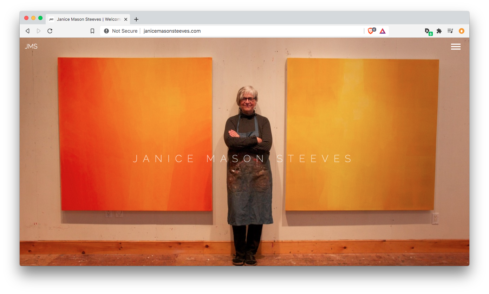

# **Janice Mason Steeves Official Website**

The official website of Canadian artist and educator Janice Mason Steeves. Janice is represented by galleries in Canada and the U.S., with work in public, corporate, and private collections in Canada and internationally. As well as an active one-on-one Art Mentoring program, Janice teaches painting workshops in Canada, the U.S., and Europe. She has also been awarded artist residencies in Spain, Ireland, Sweden, and Iceland.

For more information see [janicemasonsteeves.com](http://janicemasonsteeves.com) and [workshopsinwildplaces.com](http://workshopsinwildplaces.com).

## **Layout and Frameworks**

The site uses Bootstrap 3.3.7, flexbox, and functional css. The structure was built to emulate a SPA/Front-end framework but using bootstrap modals, set to 100% height and width, to act effectively as separate "pages". This keeps the site relatively lightweight and fast loading, without the need to actually navigate to different urls/make additional http requests. The drawback is in the additional markup required for the modals which makes the page fairly long. Effort has been made to comment sections clearly for ease of navigation.

## **CSS**

1. Functional [Atomic] css: the site employs the atomic css approach where small, single purpose classes are used based on visual function. Classes are referenced once in the CSS then used repeatedly in the HTML so as to avoid class repetition in the stylesheet.

2. One stylesheet is used with an effort at organizing structure vertically based on relationship to HTML and page/section order. It starts with resets and global elements, proceeding to more specific styles.

3. Naming conventions: 

    - titles and headings: `.site-title`, `.page-title`, `.section-title`
    - p description subheadings and CTAs: `.p-big`, `.p-btn`
    - fonts: `Raleway` is the primary theme font.
    - background images: `.bg-img...`
    - background colors: `.bg-...`

4. Class order conventions:

    - With layout elements, classes generally proceed in the same order (with some variation depending on when edits were made or if certain individual elements needed specific treatment):
        - structural element (`.container, .row, .column`)
        - height (`.min-500`)
        - alignment (bootstrap flexbox alignment classes)
        - text alignment
        - background image, bg color, text color
        - spacing (margin and padding)
        - shadow
        - animation classes
        
    - With individual tags or text elements, classes generally proceed as:
        - size (`.h1, .h4, .p-big`)
        - color (`.text-dark`)
        - borders (if any)
        - spacing (margin and padding)
        - text shadow (`.ts`)
        - animation classes

5. Height units
    - initially `vh` was used throughout for base layout heights, ranging from `.min-100` to `.min-70` and `.min-50` classes. Google Chrome (as of Sept 18, 2018) has a 'bug' (they claim it's intentional) with vh units on mobile where the browser repaints vh elements causing janky scroll behaviour.
    - an alternative in Jaxx Liberty version 2.0 is using fixed heights but with the min-height css selector. Base heights are now `.min-700`, with an `-lg` class added to make 700px ~ 500px @media (max-width: 768px), `.min-500`, `.min-400`, and `.min-300`, the latter primarily for images. This solves the jank issue and offers good scroll UX.

## **JS**

1. Baguette Box: a lightbox library for showcasing paintings in the various "work" section modals. Find more [here](https://feimosi.github.io/baguetteBox.js/).

2. `img` load defer script: this adds a data attribute to gallery images that lazy loads them when needed, not on initial page load. 

3. JS smooth anchor scrolling menu.

 ## **Google Analytics + Statcounter**
    
1. GA gtag script is added in footer for general analytics, traffic, page views, bounce rate, etc.

2. A additional tag is added for Statcounter, a separate analytics service.